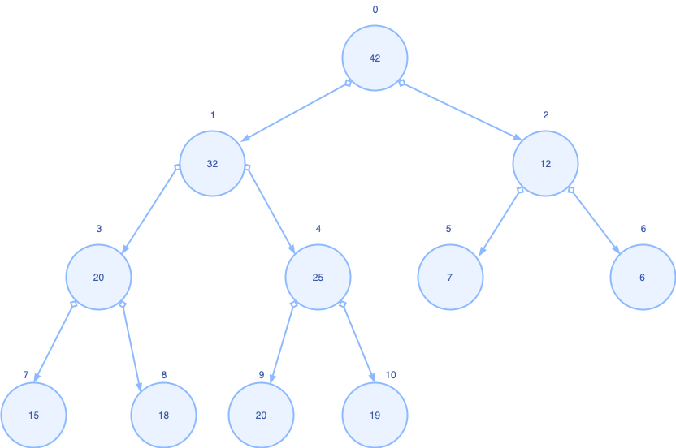

## 堆是什么

物理上：一个数组
逻辑上：堆(Heap)是一棵完全的二叉树，值存储在树的每一个节点上，且具备偏序关系（简单理解为部分有序）

大顶堆：父节点大于或等于子节点的树
小顶堆：父节点小于或等于子节点的树

## 偏序关系


### 完全二叉树



节点的编号即数组的索引，可得：
设最小编号0，最大编号n
对任意节点编号k,则
父节点编号 p= (k - 1) / 2
左子节点编号 l= k * 2 + 1
右子节点编号 r= k * 2 + 2

最后一个非叶子节点 f=(n - 1) / 2

### 构建堆（eg: 小顶堆）

需要进行堆操作时，我们可能要面临三种情况
对于一个无序的数组，我们需要

1. 将一个无序数组调整为堆

对于一个堆，我们可能对其：

1. 添加一个元素到堆中
2. 从堆中删除一个元素

#### 将一个无序数组调整为堆
步骤
1. 找到最后一个非叶子节点r
2. 使k = r
3. k <= f继续，否则执行6
4. 如果k比左右子节点都小，则执行6。否则，与左右子节点中最小的那个交换值
5. 重复2-4步骤
6. r = r - 1
7. 重复2-6步骤, 直到r < 0

以上步骤可分为两部分操作：

```java
/**
* 从后往前遍历所有非叶子节点，即步骤1-7
*/
private void init() {

        for (int i = findLastNonLeaf(); i > 0; i--) {
            siftDown(i, elements(i));
        }

    }
```

```java
/**
* 对当前非叶子节点做下沉操作，使以当前非叶子节点为
* 根节点的树调整小顶堆,即步骤3-5
*/
private void siftDown(int k,E e) {
        int lastNonLeaf = findLastNonLeaf();
        while (k <= lastNonLeaf) {
            int min = findLeftChild(k);
            E child = elements(min);
            int right = min + 1;
            if (right < size && child.compareTo(elements(right)) < 0) {
                child = elements(min = right);
            }
            if (e.compareTo(child) > 0) {
                break;
            }
            elements[k] = child;
            k = min;
        }
        elements[k] = e;
    }
```

#### 添加一个元素到堆中

步骤
1. 将新元素添加到堆尾，此时新元素编号k = size - 1
2. k > 0 继续，否则结束
3. 新元素与父节点比较，大于父节点则结束，小于父节点，则与父节点交换值，此时k = (k - 1) / 2
4. 重复2-3步骤

```java
/**
* 对当前叶子节点做上升操作，即步骤2-4
*/
```


#### 从堆中删除一个元素

步骤
1. 找到元素对应的编号k 并使start = k
2. k与队尾元素交换值 
3. 下沉k元素
4. 如果start == k，则对k上升，否则结束

```java
/**
* k与队尾元素交换后先下沉后上升
*/
private void siftUp(int k, E e) {
        while (k > 0) {
            int parentIndex = findParent(k);
            E parent = elements(parentIndex);
            if (e.compareTo(parent) <= 0) {
                break;
            }
            elements[k] = parent;
            k = parentIndex;
        }
        elements[k] = e;
    }
```


