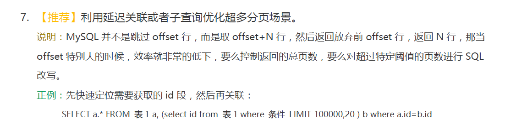
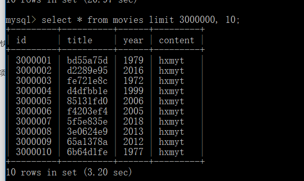
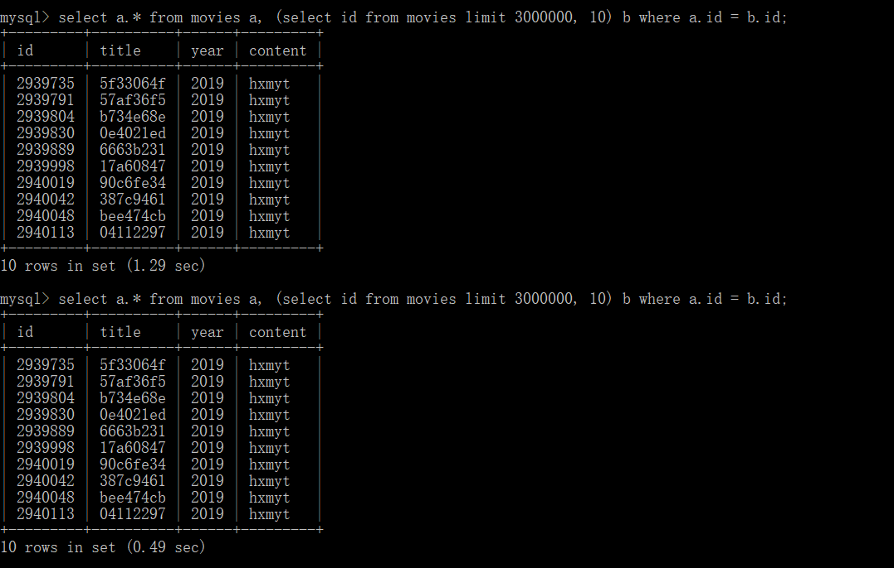
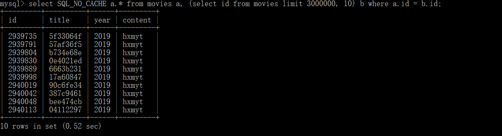
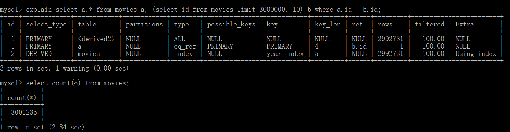
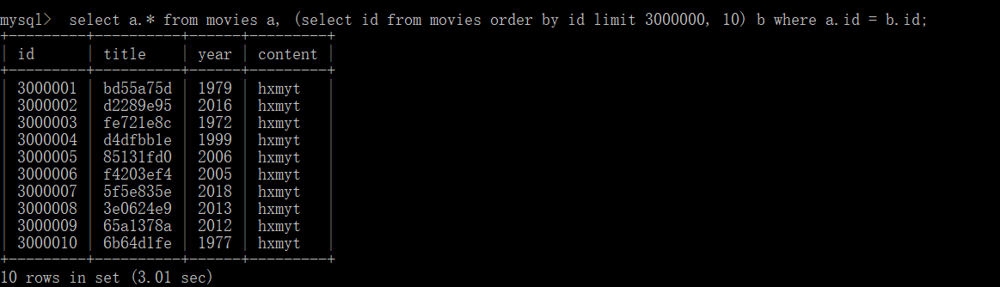
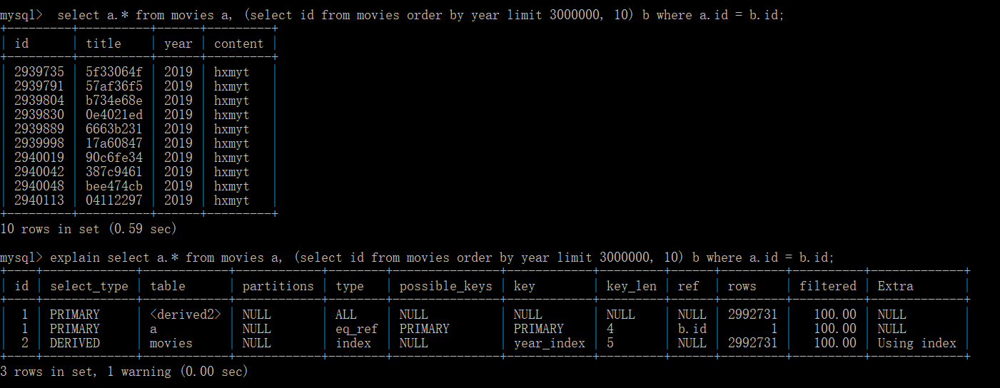
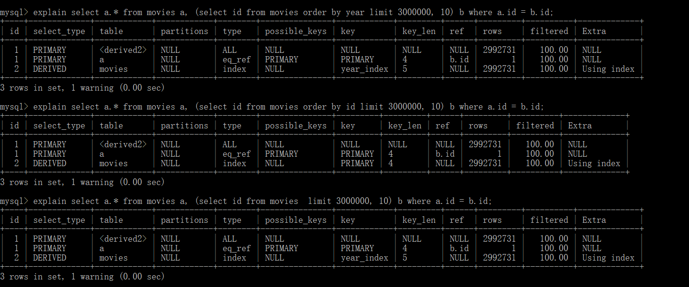

在阿里的JAVA开发手册中有这么一句



```mysql
#建表
CREATE TABLE `movies` (
  `id` int(11) NOT NULL AUTO_INCREMENT,
  `title` varchar(20) DEFAULT NULL,
  `year` int(11) DEFAULT NULL,
  `content` varchar(20) DEFAULT 'hxmyt',
  PRIMARY KEY (`id`),
  KEY `year_index` (`year`)
) ENGINE=InnoDB DEFAULT CHARSET=utf8;

#创建存储过程，插入百万数据
CREATE DEFINER=`root`@`localhost` PROCEDURE `randomMovies`()
begin
declare i int default 0;
while i <= 1000000 do
 insert into movies(title, year) values(substring(md5(rand()),1,8), floor(1970 + rand() * 50));
set i = i + 1;
end while;
end

#修改存储引擎位MySIAM
ALTER TABLE movies ENGINE=MySIAM;
#调用存储过程出入记录
call randomMovies();
call randomMovies();
call randomMovies();
#修改存储引擎位INNODB
ALTER TABLE movies ENGINE=INNODB;
```

第一次查询

耗时3.2秒

尝试limit优化


速度确实变快了，但出现了两个新的问题

1.第一次查询为什么会变慢？

2.优化后返回的结果集与有优化前不同

猜测问题一：第二次调用使用了缓存

验证：使用SQL_NO_CACHE


没有区别,难道不是缓存的原因？

问题二：explain试一下

发现扫描的行数为与总行数不同

查了一下是预估值，那可能是因为索引排序有问题，3000000放在293975后面

尝试下排序



排序后要3秒之久

更换排序条件为year


速度很快，而且结果和不加排序居然一样，才发现两道查询都默认使用了year为索引

当使用主键索引的时候速度会变慢

猜测：都产生了覆盖索引，但是主键叶子节点就是行数据，加载起来会非常慢，
辅组索引叶子节点是主键，加载更快。

验证方式：待定

