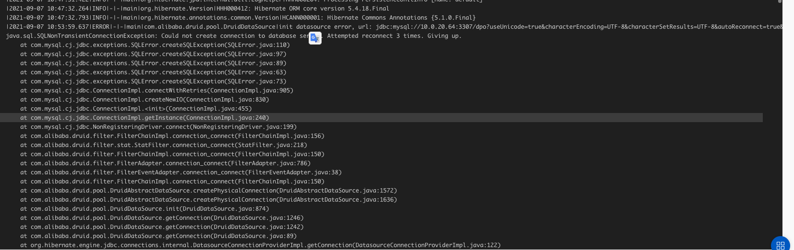

### 环境：
1. druid
2. k8s
3. mysql
4. java
5. spring boot

### 背景

```
测试服某个应用部署失败，失败原因反馈为k8s readiness探针检测失败，connection refused。
```

### 定位

k8s的探针通过spring boot actuator提供的readiness和liveness健康检测提供，故先本地启动应用
查看检测接口是否正常访问，启动后发现主线程main阻塞，等待一段时间后抛出MySQL连接重试失败异常，由此
可判定MySQL连接失败导致的问题，主线程阻塞时间过长，无法接收请求导致k8s探针请求connection refused。

### 为什么长时间阻塞
现场：



查看对MySQL的连接配置信息：应用使用druid管理连接
```java
设置了最大连接等待时间60秒
druidDataSource.setMaxWait(60000);
```
由上诉异常信息可知连接重试了3次
但应用并未显式配置重试次数
猜测使用了默认配置
（1） 查看druid是否有重试配置
```
connectCount = 0
只看到一个关于连接次数的配置，但其默认值为0，与3次重试结果不符，应该不是这个

```

（2）查看MySQL Connector 配置


com.mysql.cj.conf.PropertyKey类定义了相关的连接配置

.png)

com.mysql.cj.conf.PropertyDefinitions为配置属性做了初始化，并将最大连接重试次数设置为3

.png)


### 解决方案

根本原因为原来的服务器下线，迁移到了新的实例，而应用的配置未更新
把配置更新解决了

